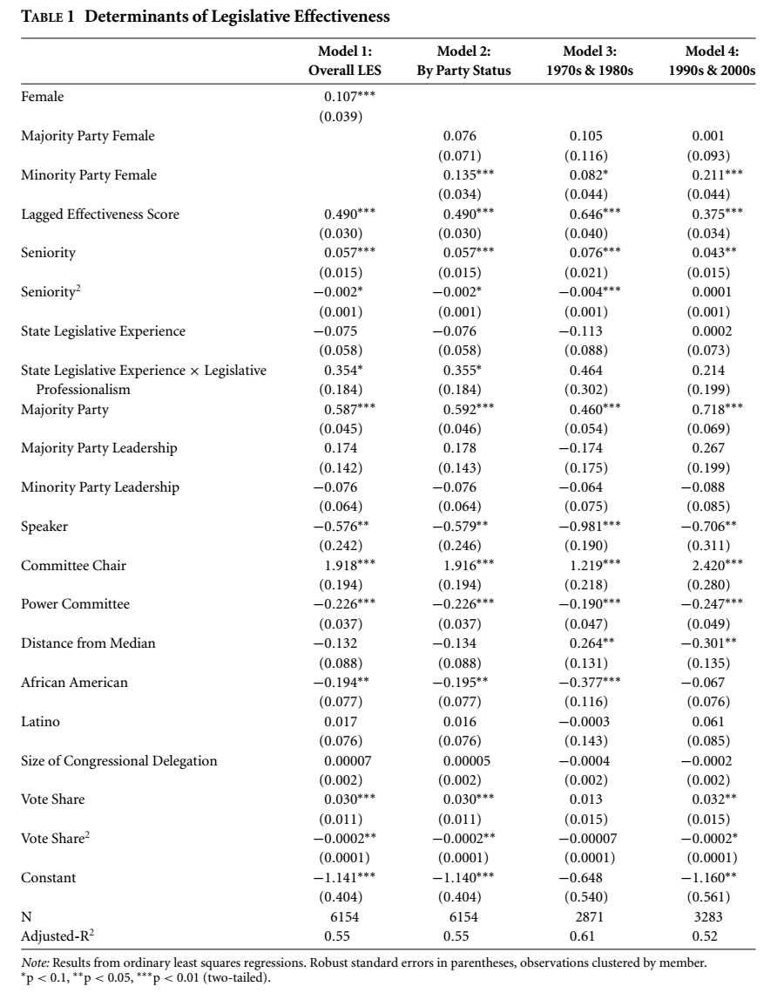
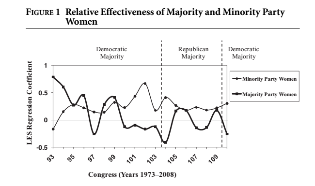
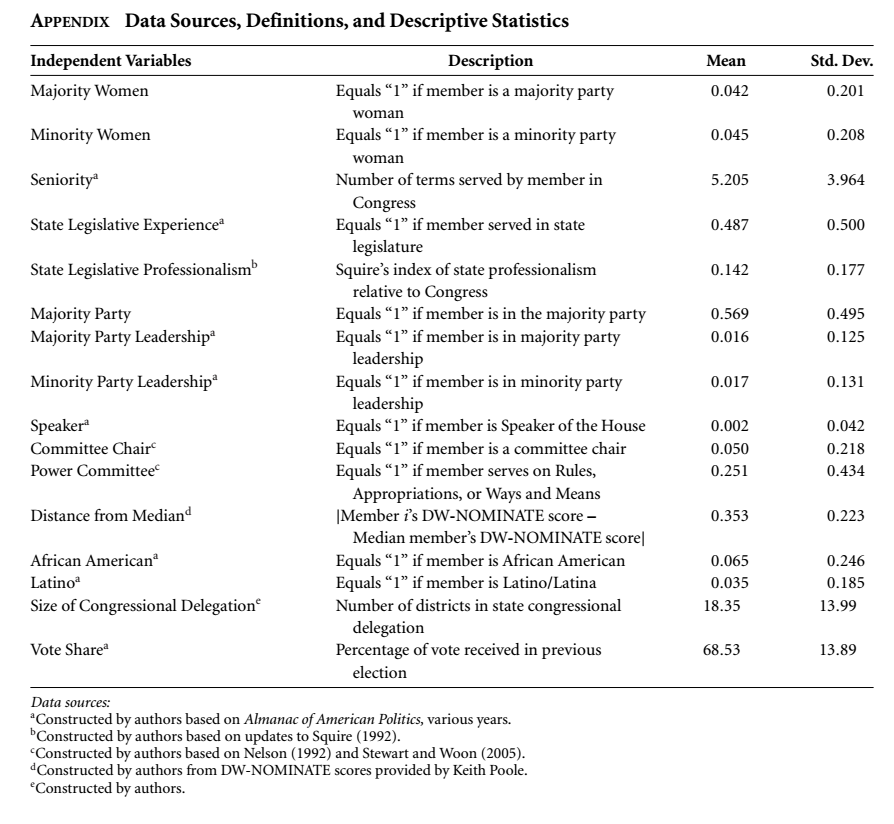

```{r setup, include=FALSE}
knitr::opts_chunk$set(echo = TRUE)
```

#When Are Women More Effective Lawmakers Than Men?
`Volden, C., Wiseman, A. E., & Wittmer, D. E. (2013). When Are Women More Effective`
`Lawmakers Than Men? American Journal of Political Science, 57(2), 326–341.`
`http://doi.org/10.1111/ajps.12010`

The paper builds on previous research about the consensus-seeking nature of women lawmakers in the US Congress and investigates how effective it is in different institutional settings. The authors primarily consider two such settings:
* Women in the Majority Party
* Women in the Minority Party
Upfront, the authors argue that in the minority party, women lawmakers are more effective at bringing about new policies than men owing to their known propensity to build coalitions. Through collection and analysis of data on the proceedings of Congress from 1973 to 2008, the authors report strong evidence to support their argument.

The authors also argue that majority party women too are successful at keeping their legislative proposals alive for longer, but the effects of their consensus-building inclination are less pronounced in the majority party.

To find support for these arguments, the authors report coefficients of multivariate linear regression where they treat Legislative Efficiency Score as an independent variable, and some other variables like whether a legislator is a female or male (`d$female`), whether the female legislator is in the majority party (`d$majwomen`) or in the minority party (`d$minwomen`), and seniority (`d$seniority`), etc.

In this report, I am choosing to analyse 4 linear models as described in the paper. Models 3 and 4 are variations of Model 2, where the data has been split across Congress sessions for the 70s-80s, and 90s-00s. In addition, I replicate a base R plot as closely as possible. Finally I replicate the descriptive statistics (mean and sd) for the data.

##Reading in the dataset
The dataset for this study is openly available [here](https://dataverse.harvard.edu/dataset.xhtml?persistentId=hdl:1902.1/18911) 
in the file titled `vww_ajps_replication_data.dta`. 

For the purpose of this assignment, however, I converted the .dta file (a Stata format) into a CSV file [`vww_ajps_replication_data.csv`](vww_ajps_replication_data.csv) using `write.csv` function outside of this Rmd.

```{r}
d <- read.csv("vww_ajps_replication_data.csv")
names(d)
head(d)
```

#Regression Models {.tabset}
##Model 1
**LES ~ Gender + (other variables)**
This model studies the impact of gender (along with other variables listed below in the formula) on Legislative Efficiency.
```{r}
m1 <- lm(data=d, les ~ female + leslag + seniority + sensq + state_leg + state_leg_prof + majority + maj_leader + min_leader + speaker + chair + power + meddist + afam + latino + deleg_size + votepct + votepct_sq)

summary(m1)
```

##Model 2
**LES ~ Women in Majority Party + Women in Minority Party + (other variables)**
In contrast to Model 1, this model studies the impact of women in a minority party contribute on Legislative Efficiency, vs that of women in a majority party.
```{r}
m2 <- lm(data=d, les ~ majwomen + minwomen + leslag + seniority + sensq + state_leg + state_leg_prof + majority + maj_leader + min_leader + speaker + chair + power + meddist + afam + latino + deleg_size + votepct + votepct_sq)

summary(m2)
```
**Data separation according to decade**
The data column `congress` in the original dataset carries the Congress session number. While absent from the data itself, Congress session numbers can be matched to the years they were held in using information here: http://history.house.gov/Institution/Joint-Sessions/80-99/

As per the authors, Model 3 is the same as Model 2, except that it only takes sessions from the 70s and the 80s into account. That makes it Congress sessions 93 to 101 (inclusive). Similarly, Model 4 is the same as Model 2, but for Congress sessions from the 90s and the 2000s, i.e. session numbers 102 to 110 (inclusive).

##Model 3
**Same as Model 2, but for Congress sessions from the 70s and 80s**
```{r}
d1 <- d[d$congress %in% 93:101,] #congress sessions from the 70s and 80s
m3 <- lm(data=d1, les ~ majwomen + minwomen + leslag + seniority + sensq + state_leg + state_leg_prof + majority + maj_leader + min_leader + speaker + chair + power + meddist + afam + latino + deleg_size + votepct + votepct_sq)

summary(m3)
```
##Model 4
**Same as Model 2, but for Congress sessions from the 90s and 2000s**
```{r}
d2 <- d[d$congress %in% 102:110,] #congress sessions from the 90s and 00s
m4 <- lm(data=d2, les ~ majwomen + minwomen + leslag + seniority + sensq + state_leg + state_leg_prof + majority + maj_leader + min_leader + speaker + chair + power + meddist + afam + latino + deleg_size + votepct + votepct_sq)

summary(m4)
```
##Published Models


#Plots
##Replicated
```{r}
#create a new data frame with columns that we'd need to plot the graph as in the paper
reg.coefs <- data.frame(row.names= c("congress", "majwomen.coef", "minwomen.coef"))

#this loop loops through data for each unique session of Congress one by one,
#and creates a subset data frame 'dc' that only has the columns of interest. These 
#columns include those that form the predictor variables in the linear models built
#by the authors.
for (cong in sort(unique(d$congress))) {  #sort the unique congress numbers
  dc <- d[d$congress == cong,]   #pick out a Congress session
  
  #subset the data frame from previous line. The call to complete.cases() ensures that only those rows are retained that have no NAs in any of the columns specified.
  dc <- dc[complete.cases(dc[, c(10:12, 28:39, 40:42)]),]  
  
  #check if the subset so obtained is empty. if so, skip to the top of the loop and look at a new Congress session
  if (nrow(dc) == 0) {
    next
  }
  
  #create a model based on the subset, and based on the same set of predictors as Model 2 above
  mc <- lm(data=dc, les ~ majwomen + minwomen + seniority + sensq + state_leg + state_leg_prof + majority + maj_leader + min_leader + speaker + chair + power + meddist + afam + latino + deleg_size + votepct + votepct_sq)
  
  #create a new record or row for the reg.coefs data frame created at the top of this section.
  newrecord <- data.frame(congress=cong, majwomen.coef=coef(mc)[2], minwomen.coef=coef(mc)[3])
  
  #insert the new record into the reg.coefs data frame
  reg.coefs <- rbind(reg.coefs, newrecord)
}

x = reg.coefs$congress #read in just the Congress session numbers into x
ymaj = reg.coefs$majwomen.coef #read in the regression coefficient for the Women in Majority Party variable
ymin = reg.coefs$minwomen.coef #read in the regression coefficient for the Women in Minority Party variable
########par(oma=c(1,1,1,4))

#plot the first graph: Regression Coeffs. (Women in Majority Party) Vs Congress Session
plot(x, ymaj, type="p", pch=15, cex=1.3, ylim=c(-0.5, 1), xlab="Congress (Years 1973-2008)", ylab="LES Regression Coefficient", xaxp=c(93,111,18))

#Fit a nice, smooth curve through the points rather than a jagged graph
xspline(x, ymaj, shape=-0.4, lwd=4)

#Make sure the next plot is plotted in the same plot object as the one above
par(new=TRUE)

#plot the second graph: Regression Coeffs. (Women in Minority Party) Vs Congress Session
plot(x, ymin, type="p", pch=16, cex=1.3, ylim=c(-0.5, 1), xlab="Congress (Years 1973-2008)", ylab="LES Regression Coefficient", xaxp=c(93,111,18))

#Fit a nice, smooth curve through the points rather than a jagged graph
xspline(x, ymin, shape=-0.4, lwd=2)

#create a horizontal, dashed line passing through y=0
abline(h=0, lty=1)

#create a vertical, dashed line passing through x=104
abline(v=104, lty=2)

#create a vertical, dashed line passing through x=109.5
abline(v=109.5, lty=2)

#Create a legend for the plot and place it at the top-right corner
legend("topright", c("Minority Party Women", "Majority Party Women"), lty=c(1,1), lwd=c(2, 4), pch=c(16, 15), pt.cex=c(1.3,1.3), cex=c(0.7,0.7))
```

##Published


#Descriptive Statistics {.tabset}
##Code for replication
To replicate the descriptive statistics for the data used in the paper, I populated a data frame row for each parameter in the table in the original paper (pp. 339). Each row contains the name of the independent variable, its mean across all observations, and its standard deviation across all observations. These seem to match perfectly with the report in the paper.
```{r}
#create an empty data frame with column names defined as below.
desc.stats <- data.frame(row.names = c("Independent_Variables", "Mean", "Std.Dev."))

#populate the data frame one-by-one
desc.stats <- rbind(desc.stats, data.frame(Independent_Variables="Majority Women", Mean=round(mean(d$majwomen, na.rm = TRUE),3), Std.Dev.=round(sd(d$majwomen, na.rm = TRUE), 3)))
desc.stats <- rbind(desc.stats, data.frame(Independent_Variables="Minority Women", Mean=round(mean(d$minwomen, na.rm = TRUE),3), Std.Dev.=round(sd(d$minwomen, na.rm = TRUE), 3)))
desc.stats <- rbind(desc.stats, data.frame(Independent_Variables="Seniority", Mean=round(mean(d$seniority, na.rm = TRUE),3), Std.Dev.=round(sd(d$seniority, na.rm = TRUE), 3)))
desc.stats <- rbind(desc.stats, data.frame(Independent_Variables="State Legislative Experience", Mean=round(mean(d$state_leg, na.rm = TRUE),3), Std.Dev.=round(sd(d$state_leg, na.rm = TRUE), 3)))
desc.stats <- rbind(desc.stats, data.frame(Independent_Variables="State Legislative Professionalism", Mean=round(mean(d$state_leg_prof, na.rm = TRUE),3), Std.Dev.=round(sd(d$state_leg_prof, na.rm = TRUE), 3)))
desc.stats <- rbind(desc.stats, data.frame(Independent_Variables="Majority Party", Mean=round(mean(d$majority, na.rm = TRUE),3), Std.Dev.=round(sd(d$majority, na.rm = TRUE), 3)))
desc.stats <- rbind(desc.stats, data.frame(Independent_Variables="Majority Party Leadership", Mean=round(mean(d$maj_leader, na.rm = TRUE),3), Std.Dev.=round(sd(d$maj_leader, na.rm = TRUE), 3)))
desc.stats <- rbind(desc.stats, data.frame(Independent_Variables="Minority Party Leadership", Mean=round(mean(d$min_leader, na.rm = TRUE),3), Std.Dev.=round(sd(d$min_leader, na.rm = TRUE), 3)))
desc.stats <- rbind(desc.stats, data.frame(Independent_Variables="Speaker", Mean=round(mean(d$speaker, na.rm = TRUE),3), Std.Dev.=round(sd(d$speaker, na.rm = TRUE), 3)))
desc.stats <- rbind(desc.stats, data.frame(Independent_Variables="Committee Chair", Mean=round(mean(d$chair, na.rm = TRUE),3), Std.Dev.=round(sd(d$chair, na.rm = TRUE), 3)))
desc.stats <- rbind(desc.stats, data.frame(Independent_Variables="Power Committee", Mean=round(mean(d$power, na.rm = TRUE),3), Std.Dev.=round(sd(d$power, na.rm = TRUE), 3)))
desc.stats <- rbind(desc.stats, data.frame(Independent_Variables="Distance from Median", Mean=round(mean(d$meddist, na.rm = TRUE),3), Std.Dev.=round(sd(d$meddist, na.rm = TRUE), 3)))
desc.stats <- rbind(desc.stats, data.frame(Independent_Variables="African American", Mean=round(mean(d$afam, na.rm = TRUE),3), Std.Dev.=round(sd(d$afam, na.rm = TRUE), 3)))
desc.stats <- rbind(desc.stats, data.frame(Independent_Variables="Latino", Mean=round(mean(d$latino, na.rm = TRUE),3), Std.Dev.=round(sd(d$latino, na.rm = TRUE), 3)))
desc.stats <- rbind(desc.stats, data.frame(Independent_Variables="Size of Congressional Delegation", Mean=round(mean(d$deleg_size, na.rm = TRUE),3), Std.Dev.=round(sd(d$deleg_size, na.rm = TRUE), 3)))
desc.stats <- rbind(desc.stats, data.frame(Independent_Variables="Vote Share", Mean=round(mean(d$votepct, na.rm = TRUE),3), Std.Dev.=round(sd(d$votepct, na.rm = TRUE), 3)))
#names(desc.stats) <- c("Independent Variables", "Mean", "Std.Dev.")
```
##Calculated Stats
```{r}
#display the data frame
desc.stats
```
##Reported Stats
